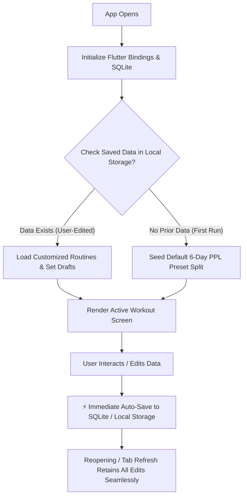
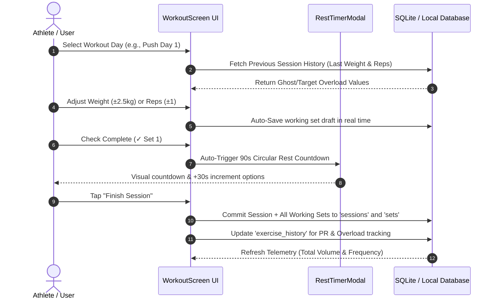
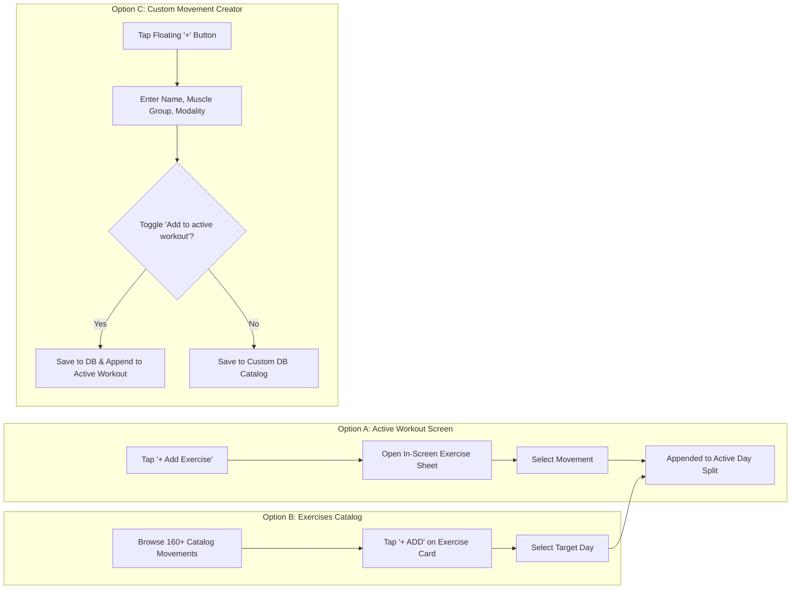

# ⚡ IronPulse — High-Performance Resistance & Workout Logger

**IronPulse** is an offline-first, zero-latency workout tracking and resistance training application built with Flutter, SQLite, and Docker. It features real-time auto-saving, progressive overload telemetry, custom movement creation, interactive plate calculators, floating rest timers, and multi-platform deployment (Android APK, Web Container, Desktop).

---

## 🏗️ System Architecture & Program Flow

### 1. App Startup & Data Lifecycle Flow



---

### 2. Live Workout Execution & Rest Timer Flow



---

### 3. Exercise Addition & Custom Movement Flow



---

## 🌟 Key Features

| Feature | Description |
|---|---|
| **⚡ Instant Auto-Save** | Zero-latency persistence for steppers (`±2.5kg`, `±1 rep`), target RPE, rest seconds, notes, and completion checks. |
| **💾 100% Offline-First** | Runs completely local via SQLite without requiring active network connectivity. |
| **📚 160+ Catalog Movements** | Comprehensive exercise library spanning Chest, Back, Shoulders, Arms, Legs, Core, and Calves. |
| **✨ Custom Movements** | Create personalized exercises with custom modalities (Barbell, Dumbbell, Cable, Bodyweight, Machine). |
| **👻 Ghost Progressive Overload** | Automatically displays previous weight and reps directly beneath working set inputs. |
| **⏱️ Floating Rest Timer** | Configurable circular countdown timer with instant `+30s` bump. |
| **🏋️ Olympic Plate Calculator** | Visual breakdown calculating required plates per side for any barbell weight. |
| **📊 Volume & Telemetry** | Tracks completed sessions, working set volume (kg/lbs), and workout history logs. |

---

## 📁 Repository Structure

```text
gym_scheduler/
├── downloads/
│   └── ironpulse.apk               # Latest Pre-Built Release Android APK (~49.7 MB)
├── ironpulse_app/                  # Flutter Mobile & Web Codebase
│   ├── lib/
│   │   ├── db_helper.dart          # Local SQLite Database & Cross-Platform Engine
│   │   ├── dialogs.dart            # Exercise Customizer & Olympic Plate Calculator
│   │   ├── main.dart               # App Entry Point & Root Navigation Shell
│   │   ├── models.dart             # Exercise, Routine, Session, and Preset Models
│   │   ├── theme.dart              # Kinetic Obsidian Dark Design System
│   │   └── screens/
│   │       ├── workout_screen.dart # Active Workout Logger & Rest Timer
│   │       ├── exercises_screen.dart# Catalog, Search, and Exercise Adder
│   │       ├── history_screen.dart # Workout History Logs & Telemetry
│   │       └── settings_screen.dart# Unit Toggle (kg/lbs) & Data Management
│   ├── test/
│   │   └── widget_test.dart        # Routine & Persistence Unit Tests
│   ├── Dockerfile                  # Multi-Stage Production Docker Build
│   ├── nginx.conf                  # Nginx Configuration for Web Delivery
│   └── pubspec.yaml                # Flutter Dependencies & Asset Declarations
├── database/                       # SQL Schemas & 60+ exercises dataset
│   ├── exercises.json              # Standardized exercise database
│   ├── init.sql                    # Initial SQL database schema
│   ├── schema.sql                  # Relational table schema
│   └── seed.sql                    # Seed migration script
├── backend/                        # Node.js API (Optional standalone backend)
│   ├── db.js
│   ├── package.json
│   └── server.js
├── docker-compose.yml              # Multi-Container Orchestration (App + PostgreSQL)
└── README.md                       # Complete Project Documentation & Flowchart
```

---

## 🚀 Quick Start & Deployment

### 🐳 Option 1: Run with Docker Desktop (Recommended for Web)

Start the production container stack with a single command:

```powershell
docker compose up -d --build
```

- **Web App:** [http://localhost:8080](http://localhost:8080)
- **Database:** `localhost:5432` (`gym_scheduler`)

To stop the containers:
```powershell
docker compose down
```

---

### 📱 Option 2: Install Android Mobile App

The release APK is compiled and ready in the repository:

1. Locate the APK at [downloads/ironpulse.apk](downloads/ironpulse.apk).
2. Transfer the file to your Android phone (or install via `adb install downloads/ironpulse.apk`).
3. Open **IronPulse** on your device — all data is saved locally on the device.

---

### 💻 Option 3: Run Locally with Flutter SDK

```powershell
# Navigate to the Flutter app directory
cd ironpulse_app

# Install dependencies
flutter pub get

# Run on Chrome / Web Browser
flutter run -d chrome

# Run tests
flutter test

# Build a new Android Release APK
flutter build apk --release
```

---

## 🗄️ Database Schema & Storage Details

### 1. SQLite Relational Schema (`ironpulse.db`)

- **`exercises`**: Stores all preloaded and custom movements (`id`, `name`, `muscle_group`, `modality`, `is_custom`, `is_favorite`).
- **`sessions`**: Stores completed workout sessions (`id`, `title`, `date`, `duration_seconds`, `total_volume`, `unit`, `notes`).
- **`sets`**: Stores each working set recorded in a session (`id`, `session_id`, `exercise_id`, `set_number`, `weight`, `reps`, `completed`).
- **`exercise_history`**: Maintains real-time personal bests and last recorded performance for progressive overload hinting.

### 2. Routine Customizations (`SharedPreferences`)

- Routine splits, active day selections, target rep ranges, target RPE, rest intervals, and exercise draft sets are serialized to JSON and persisted on every change.

---

## 🧪 Verification & Testing

- **Static Analysis:** `flutter analyze` — **0 issues**
- **Unit & Persistence Tests:** `flutter test` — **100% Passed (3/3 test suites)**
